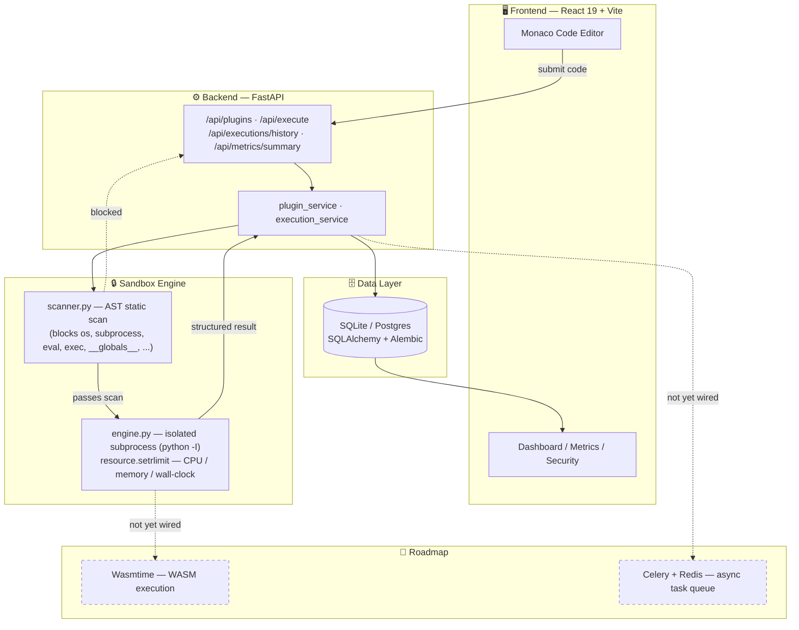

<div align="center">

# 🧪 WasmBox Sandbox

**A sandboxed plugin execution platform for running untrusted code safely — in the browser, on your terms.**

Write plugin code in an in-browser editor → run it in an isolated, resource-limited backend sandbox → inspect results, logs, and historical metrics in real time.

[](https://www.python.org/)
[](https://fastapi.tiangolo.com/)
[](https://react.dev/)
[](https://vitejs.dev/)
[](https://tailwindcss.com/)
[](https://wasmtime.dev/)
[](#license)

</div>

---

## Table of Contents

- [Overview](#overview)
- [Why This Stack](#why-this-stack)
- [Architecture](#architecture)
- [Tech Stack](#tech-stack)
- [Features](#features)
- [Project Structure](#project-structure)
- [Getting Started](#getting-started)
- [Security Model](#security-model)
- [Roadmap](#roadmap)
- [Contributing](#contributing)
- [License](#license)

---

## Overview

**WasmBox Sandbox** lets you write a plugin in the browser, execute it against a hardened backend sandbox, and immediately see whether it passed a static security scan, how long it ran, how much memory it used, and what it printed — all without ever giving the plugin real access to your system.

It's built for the exact problem every plugin/extension/user-script platform eventually hits: **how do you run someone else's code without trusting them?**

> **Current status:** the core loop — write → scan → execute → inspect — is fully working end-to-end on a FastAPI backend and a React 19 frontend. Authentication and a plugin marketplace exist as scaffolding/data models but are not wired into the live API yet. See [Roadmap](#roadmap).

---

## Why This Stack

Every technology choice here is deliberate, not default:

| Choice | Why it matters |
|---|---|
| **AST-based static analysis** (not regex/string matching) | Parses submitted code into a syntax tree before execution, so obfuscated or dynamically-constructed dangerous calls (`getattr(os, 'sys' + 'tem')`) get caught — a plain keyword blocklist can't do this. |
| **OS-level resource limits** (`resource.setrlimit`) | CPU time and memory caps are enforced by the kernel, not just application logic — a runaway or malicious plugin can't out-clever a Python-level timer. |
| **Process isolation via `python -I`** | Runs each plugin in isolated mode in its own subprocess — no shared site-packages, no implicit `sys.path` pollution, no access to the host interpreter's state. |
| **FastAPI + Pydantic** | Async-first, fully typed request/response validation with automatic OpenAPI docs generated for free — no separate API spec to maintain by hand. |
| **SQLAlchemy ORM + Alembic** | Versioned, reversible schema migrations instead of hand-run SQL scripts — every schema change is code-reviewable and rollback-able. |
| **React 19 + Vite** | Instant HMR during development and a modern concurrent-rendering React runtime for a snappy editor experience, even with large execution-history datasets. |
| **Monaco Editor** | The same code-editing engine that powers VS Code — real syntax highlighting, IntelliSense-style completions, and a familiar editing experience for plugin authors. |
| **Zustand** | State management without boilerplate — no reducers, no providers wrapping the whole tree, just small composable stores (`executionStore`, `pluginStore`). |
| **Tailwind CSS 4** | CSS-first configuration (no `tailwind.config.js` build step) and a smaller, faster-compiling utility engine. |
| **Recharts** | Declarative, composable charting for the metrics dashboards (activity, runtime, success rate) instead of hand-rolled canvas/D3 code. |
| **WebAssembly via Wasmtime** *(planned)* | The named destination for this project: compiling plugin code to WASM gets you sandboxing guaranteed by linear-memory isolation at the runtime level — a fundamentally stronger boundary than OS process limits alone. Dependency is already installed; integration is the current top roadmap item. |
| **Celery + Redis** *(planned)* | Moves execution off the request/response cycle entirely, enabling queuing, retries, and horizontal worker scaling instead of one synchronous subprocess per request. |

---

## Architecture



**Request flow, step by step:**

1. A plugin author writes code in the Monaco editor and hits *Run*.
2. `POST /api/execute` sends the source to the backend.
3. `scanner.py` parses it into an AST and rejects it outright if it imports dangerous modules (`os`, `subprocess`, `socket`, `ctypes`, `pickle`, `requests`, ...), calls dangerous builtins (`eval`, `exec`, `open`, `__import__`, `getattr`/`setattr`), or touches sandbox-escape attributes (`__subclasses__`, `__globals__`, `__mro__`).
4. If it passes, `engine.py` forks an isolated `python -I` subprocess with hard CPU-time and memory ceilings (`resource.setrlimit`) plus a wall-clock timeout, and captures stdout/stderr.
5. A structured result (`status`, `return_code`, `duration_ms`, `memory_mb`, `output`, `logs`, `error_message`) is persisted and streamed back to the UI.
6. The Metrics and Security dashboards read this history straight out of the same database.

---

## Tech Stack

<table>
<tr><th>Layer</th><th>Technologies</th></tr>
<tr>
<td><b>Backend</b></td>
<td>

`Python 3.11+` · `FastAPI` · `Uvicorn` · `SQLAlchemy` · `Alembic` · `Pydantic`

</td>
</tr>
<tr>
<td><b>Sandbox / Execution</b></td>
<td>

`ast` (static analysis) · `subprocess` (`python -I`) · `resource` (rlimit) — with `wasmtime` installed for the planned WASM execution path

</td>
</tr>
<tr>
<td><b>Frontend</b></td>
<td>

`React 19` · `Vite` · `Tailwind CSS 4` · `Zustand` · `React Router` · `Monaco Editor` · `Recharts`

</td>
</tr>
<tr>
<td><b>Data</b></td>
<td>

`SQLite` (dev) → Postgres-ready via SQLAlchemy · UUID primary keys · versioned Alembic migrations

</td>
</tr>
<tr>
<td><b>Deployment</b></td>
<td>

Frontend: static Vite build via `vercel.json` · Backend: ASGI-ready for any Uvicorn/Gunicorn host — with `celery` + `redis` installed for the planned async task-queue path

</td>
</tr>
</table>

---

## Features

- ✅ **In-browser Monaco editor** with toolbar, live console, and structured execution results
- ✅ **AST-based static security scanner** — runs *before* any code executes, catching obfuscated dangerous calls a keyword filter would miss
- ✅ **Hard resource limits** — CPU time, memory, and wall-clock timeouts enforced at the OS level, not just in application code
- ✅ **Full plugin CRUD** with a clean REST API and auto-generated OpenAPI docs
- ✅ **Execution history & metrics dashboards** — activity over time, runtime distribution, success rate, all backed by real persisted data
- ✅ **Security dashboard** — live view of sandbox status, active resource limits, and scan results
- 🚧 **Authentication** — data model exists, login flow not yet wired up
- 🚧 **Plugin marketplace** — reviews/favorites/categories explored, not in the current API surface
- 🚧 **WASM execution** — `wasmtime` is installed; today's sandbox runs plugins as restricted native subprocesses, not compiled WASM modules
- 🚧 **Async task queue** — `celery` + `redis` installed; execution is currently synchronous per-request

---

## Project Structure

```
wasmbox-sandbox/
├── backend/
│   ├── app/
│   │   ├── api/            # plugins.py, execution.py, health.py, router.py
│   │   ├── sandbox/        # scanner.py, engine.py, _entrypoint.py  ← the core
│   │   ├── models/         # Plugin, ExecutionLog, User (SQLAlchemy ORM)
│   │   ├── services/       # plugin_service.py, execution_service.py
│   │   └── core/           # config.py (.env-driven settings)
│   ├── migrations/         # Alembic
│   └── main.py
└── frontend/
    ├── src/
    │   ├── pages/           # Dashboard, Plugins, Editor, Metrics, Security, Settings
    │   ├── components/
    │   │   ├── editor/       # CodeEditor (Monaco), EditorToolbar, Console, ExecutionResult
    │   │   ├── metrics/      # MetricCard, ActivityChart, RuntimeChart, SuccessRateChart
    │   │   ├── security/     # SandboxStatus, ResourceLimits, PermissionCard
    │   │   └── common/       # Button, Card, Badge, Tooltip
    │   ├── stores/           # Zustand: executionStore, pluginStore
    │   └── services/         # api.js, executionService.js, pluginService.js
    └── vercel.json
```

---

## Getting Started

### Prerequisites

- Python 3.11+
- Node.js 18+
- npm

### Backend

```bash
cd backend
python -m venv .venv && source .venv/bin/activate   # Windows: .venv\Scripts\activate
pip install -r requirements.txt
cp .env.example .env        # defaults to SQLite for local dev
alembic upgrade head
uvicorn main:app --reload
```

The API will be live at `http://localhost:8000`, with interactive docs at `http://localhost:8000/docs`.

### Frontend

```bash
cd frontend
npm install
npm run dev
```

The frontend expects the backend on the origin(s) listed in `CORS_ORIGINS` (defaults: `http://localhost:5173`, `http://localhost:3000`).

---

## Security Model

Untrusted plugin code is never trusted, at two independent layers:

1. **Static (pre-execution):** `scanner.py` walks the submitted code's AST and rejects anything importing dangerous modules, calling dangerous builtins, or reaching for known sandbox-escape attributes — *before* a single line runs.
2. **Dynamic (at execution):** code that passes the scan still runs in an isolated `python -I` subprocess under OS-enforced CPU, memory, and wall-clock limits, so even a scan bypass can't consume unbounded resources or persist beyond its process.

This is a defense-in-depth design, not a single point of failure — and it's the foundation the planned WASM migration builds on top of, moving from *"restricted native process"* to *"linear-memory-isolated WASM instance"* as the execution boundary.

---

## Roadmap

| Priority | Item | What it unlocks |
|---|---|---|
| 1 | **Wire in `wasmtime`** | Compile & run plugins as real WebAssembly modules — sandboxing guaranteed by the WASM runtime itself, not just OS rlimits |
| 2 | **Wire in `celery` + `redis`** | Asynchronous execution with queuing, retries, and horizontal worker scaling |
| 3 | **Authentication** | Login/signup + protected routes on top of the existing `User` model |
| 4 | **Plugin marketplace** | Reviews, favorites, categories, and tags |

---

## Contributing

Issues and pull requests are welcome. If you're picking up a roadmap item, please open an issue first so the approach can be discussed before significant work begins.

## License

[MIT](LICENSE)
